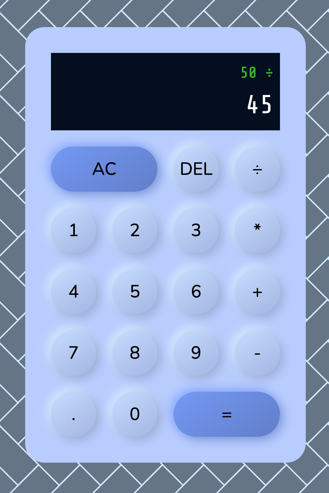

# Calculator

This calculator is my submission for the corresponding project at The Odin Project

### About the Design
The design is inspired by [neumorphism](https://uxdesign.cc/neumorphism-in-user-interfaces-b47cef3bf3a6) with the 
shadows generated through [neumorphism.io](https://neumorphism.io/)

The background is a plain CSS pattern from [CSS3 Pattern Gallery](https://projects.verou.me/css3patterns/)

----
**Notice**  
If you try to divide by zero you will get an error message before you click the *equals* button. In case you want to divide by a decimal number that starts with zero, use the dot instead. 

